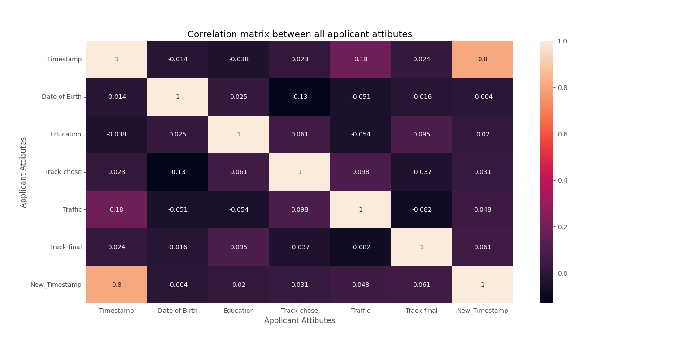
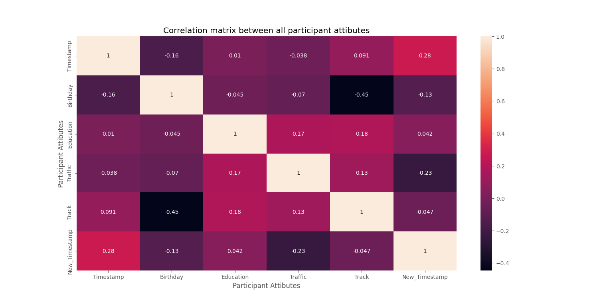
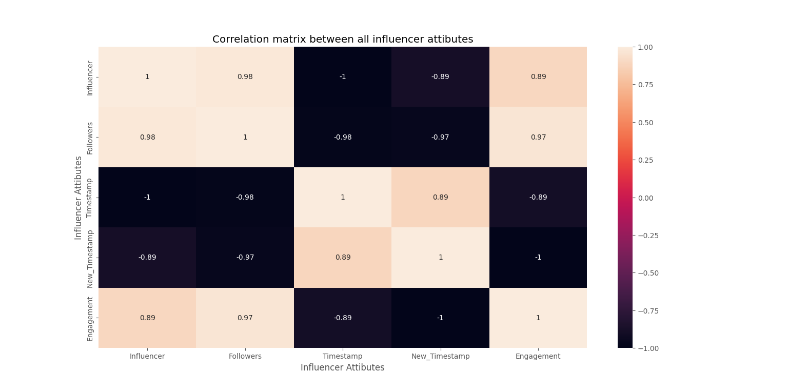
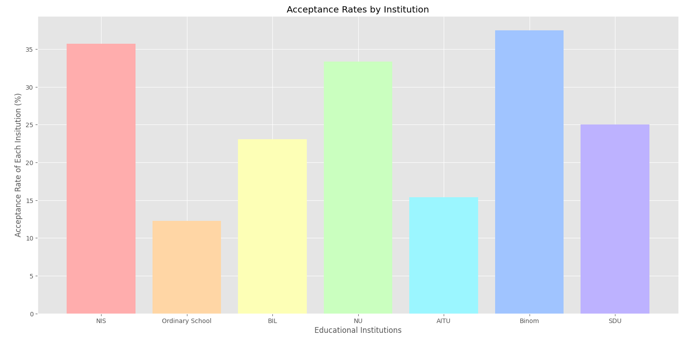
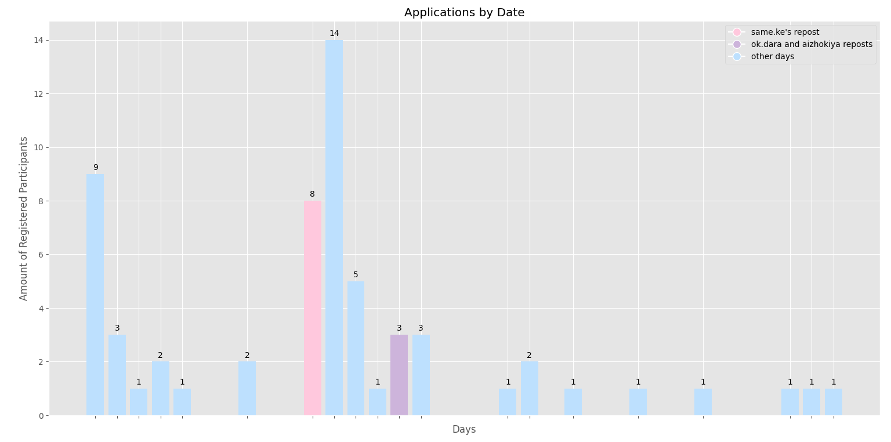

# Coding Camp Promo-campaign and Admission Analytics


## Authors

- [@aruryss](https://www.github.com/aruryss)

## Table of Contents

  - [Questions & Hypothesis](#Questions-Hypothesis)
  - [Approach & Analysis](#Approach-Analysis)
  - [Technical challenges](#Technical-challenges)
  - [Tech Stack](#tech-stack)
  - [Quick glance at the results](#quick-glance-at-the-results)
  - [Assumptions & Limitations](#Assumptions-Limitations)
  - [Q1: Educational background & Acceptance rate](#Q1)
  - [Q2: Instagram influencer traffic](#Q2)
  - [Q3: Instagram influencer traffic & follower amount](#Q3)
  - [Q4: Instagram influencer traffic & engagement](#Q4)
  - [Deeper analysis](#Deeper-analysis)
  - [Final results](#Final-results)
  - [Future Improvements](#Future-Improvements)
  - [Full Report](#Full-Report)
##
As Code Girl Summer 2023 free web development camp for girls of age 15 to 18, organized by NU ACM-Women Student Chapter came to an end, I conducted the analysis of our **promo campaign** and **educational biases** we might have during the admissions process to improve accessibility and popularity of our events.


## Questions & Hypothesis

**Q1:** Does educational background affect acceptance chance?

**H1:** _Yes, I believe that students of some institutions make up larger parts of the participants._
##

**Q2:** Which Instagram influencer drove the most traffic?

**H2:** _As some people mentioned Instagram influencer “same.ke” in their motivational letters, I believe it is “same.ke”._
##

**Q3:** Does the following of an Instagram influencer impact number of applications?

**H3:** _Yes, I think number of followers is directly proportional to the reached audience and potential applicants._
##

**Q4:** Does the engagement of an Instagram influencer impact number of applications?

**H4:** _Yes, I think engagement of the audience is directly proportional to the number of applicants_
## Approach & Analysis

1. Data was collected from applicants and participants of the camp via Google Forms.
2. Cleaned and formatted into 2 datasets of applicants and participants.
3. Columns of Education, Track-chosen, Track-final, Traffic and Timestamp were presumed to be necessary to answer the questions.
4. Instagram influencer data set with necessary data was collected and formatted by hand.
5. Graphical visualisation and statistic inference were incorporated.

## Technical challenges

- Datasets of applicants and participants were cleaned by removing duplicate values for education (Ex.:Nazarbayev University and Nazarbayev university) and removing column with motivational letters in Google Sheets
- Datasets of applicants and participants had missing value in the column Traffic, thus they were filled using Python3 Pandas library
## Tech Stack

- Python3
- Libraries: Pandas, Seaborn, MatPlotLib, NumPy, and DateTime


## Quick glance at the results

Correlation between the features of applicants.



Correlation between the features of participants.



Correlation between the features of influencers.



Acceptance rate per Educational Institution.



Application amounts by day with Instagram Influencers' repost days highlighted.




 **Lessons learned and recommendation**

Several assumptions that I made for the analysis were:

1. Applications were driven by Instagram influencers **solely** within **5-day-window** of them posting about camp
2. Educational institution indicated by applicants is their primary source of learning
3. Engagement is defined as the number of likes under the **last 6 Instagram posts** prior to the date of camp advertisement divided by the number of followers
4. Number of following of and Instagram account was regarded as of **September 3rd 2023**

Thus, limitations of the analysis are the following:

1. All those who indicated their source to be Instagram, were counted towards the amount of influencers’ traffic, if within the 5-day-window, as I could not tell for sure whether they learned about camp through their Explore page, native post or video.
2. Girls could be studying in other institutions for way longer before the one they indicated, but I cannot track all educational history, thus I refer to the one they indicated as primary one.
3. Engagement in Instagram is calculated with many factors in mind, but it is private to each user, thus I took available to me interactions with influencers’ permanent content to be engagement.
4. Due to Instagram limitations, there is no publicly and privately available information on follower count at certain date, thus I regarded follower count on [DATE TAKEN] for analysis.

## Assumptions & Limitations

- Combine this model with with a regression model to predict how much of a credit limit an applicant will be approved for.
- Hyperparameter tuning with grid search or random search.
- Better interpretation of the chi-square test
- Retrain the model without the least predictive features


## Run Locally
Initialize git

```bash
git init
```


Clone the project

```bash
git clone https://github.com/semasuka/Credit-card-approval-prediction-classification.git
```

enter the project directory

```bash
cd Credit-card-approval-prediction-classification
```

Create a conda virtual environment and install all the packages from the environment.yml (recommended)

```bash
conda env create --prefix <env_name> --file assets/environment.yml
```

Activate the conda environment

```bash
conda activate <env_name>
```

List all the packages installed

```bash
conda list
```

Start the streamlit server locally

```bash
streamlit run cc_approval_pred.py
```
If you are having issue with streamlit, please follow [this tutorial on how to set up streamlit](https://docs.streamlit.io/library/get-started/installation)

## Explore the notebook

To explore the notebook file [here](https://nbviewer.org/github/semasuka/Credit-card-approval-prediction-classification/blob/main/Credit_card_approval_prediction.ipynb)

## Deployment on streamlit

To deploy this project on streamlit share, follow these steps:

- first, make sure you upload your files on Github, including a requirements.txt file
- go to [streamlit share](https://share.streamlit.io/)
- login with Github, Google, etc.
- click on new app button
- select the Github repo name, branch, python file with the streamlit codes
- click advanced settings, select python version 3.9 and add the secret keys if your model is stored on AWS or GCP bucket
- then save and deploy!

## App deployed on Streamlit


Video to gif [tool](https://ezgif.com/)
## Repository structure


```

├── assets
│   ├── confusion_matrix.png                      <- confusion matrix image used in the README.
│   ├── gif_streamlit.gif                         <- gif file used in the README.
│   ├── heatmap.png                               <- heatmap image used in the README.
│   ├── Credit_card_approval_banner.png           <- banner image used in the README.
│   ├── environment.yml                           <- list of all the dependencies with their versions(for conda environment).
│   ├── roc.png                                   <- ROC image used in the README.
│
├── datasets
│   ├── application_record.csv                    <- the dataset with profile information (without the target variable).
│   ├── credit_records.csv                        <- the dataset with account credit records (used to derive the target variable).
│   ├── test.csv                                  <- the test data (with target variable).
│   ├── train.csv                                 <- the train data (with target variable).
│
│
├── pandas_profile_file
│   ├── credit_pred_profile.html                  <- exported panda profile html file.
│
│
├── .gitignore                                    <- used to ignore certain folder and files that won't be commit to git.
│
│
├── Credit_card_approval_prediction.ipynb         <- main python notebook where all the analysis and modeling are done.
│
│
├── LICENSE                                       <- license file.
│
│
├── cc_approval_pred.py                           <- file with the model and streamlit component for rendering the interface.
│
│
├── README.md                                     <- this readme file.
│
│
├── requirements.txt                              <- list of all the dependencies with their versions(used for Streamlit).

```
## Contribution

Pull requests are welcome! For major changes, please open an issue first to discuss what you would like to change or contribute.

## Blog post

The accompanying blog post for this project can be found [here](https://semasuka.github.io/blog/2022/10/12/credit-card-approval-prediction.html)

## Project featuring

This project was featured on [Luke Barousse Youtube Channel](https://www.youtube.com/c/LukeBarousse), Click on the thumbnail to watch the video

[](https://www.youtube.com/watch?v=5Q0gB7imNOo&t=222s)


## License

MIT License

Copyright (c) 2022 Stern Semasuka

Permission is hereby granted, free of charge, to any person obtaining a copy
of this software and associated documentation files (the "Software"), to deal
in the Software without restriction, including without limitation the rights
to use, copy, modify, merge, publish, distribute, sublicense, and/or sell
copies of the Software, and to permit persons to whom the Software is
furnished to do so, subject to the following conditions:

The above copyright notice and this permission notice shall be included in all
copies or substantial portions of the Software.

THE SOFTWARE IS PROVIDED "AS IS", WITHOUT WARRANTY OF ANY KIND, EXPRESS OR
IMPLIED, INCLUDING BUT NOT LIMITED TO THE WARRANTIES OF MERCHANTABILITY,
FITNESS FOR A PARTICULAR PURPOSE AND NONINFRINGEMENT. IN NO EVENT SHALL THE
AUTHORS OR COPYRIGHT HOLDERS BE LIABLE FOR ANY CLAIM, DAMAGES OR OTHER
LIABILITY, WHETHER IN AN ACTION OF CONTRACT, TORT OR OTHERWISE, ARISING FROM,
OUT OF OR IN CONNECTION WITH THE SOFTWARE OR THE USE OR OTHER DEALINGS IN THE
SOFTWARE.

Learn more about [MIT](https://choosealicense.com/licenses/mit/) license
